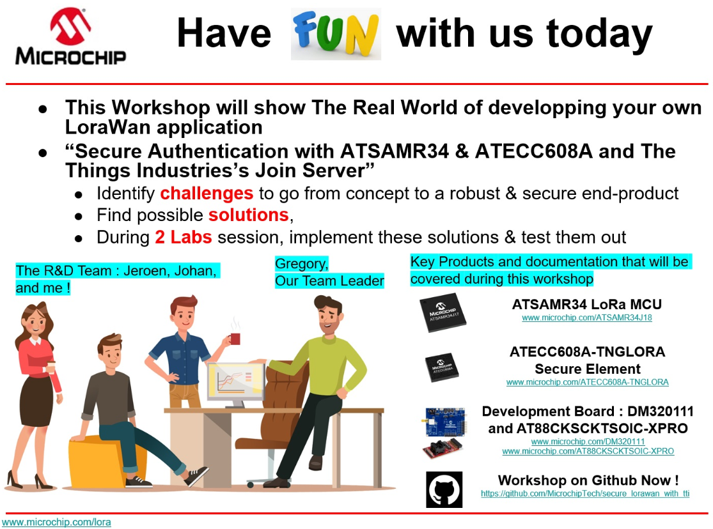
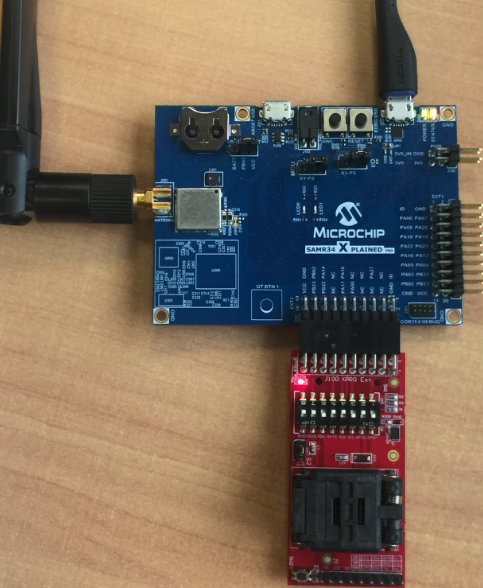

# secure_lorawan_with_tti
> “Wireless Made Fun!" - Secure Authentication with SAMR34 & ATECC608A and The Things Industries’s Join Server

<p>
<a href="https://www.microchip.com/design-centers/security-ics/trust-platform/trust-go/trust-go-lora-secure-authentication-with-join-servers" target="_blank">

&nbsp;&nbsp;&nbsp;&nbsp;&nbsp;&nbsp;&nbsp
</p>
</a>

**Welcome to the Microchip Workshop we did at The Things Conference 2020 in Amsterdam. From here you have the choice to either follow the Lab manual instructions described below or to follow the Microchip_workshop_slide.pdf document which expose you on a real situation with use cases**
</br>

**Watch the video of the workshop delivered at the Things Virtual Conference the April 16th, 2020**
<a href="https://youtu.be/BqONQ92_-fw" target="_blank">
</a>

<!--  -->

1. [Abstract](#step1)
2. [Prerequisites](#step2)
3. [Resources](#step3)
4. [Gateway Setup](#step4)
4. [Hardware Setup](#step5)
5. [Lab 1](#step6)
6. [Lab 2](#step7)


## Abstract <a name="step1"></a>

With hands-on approach, you will be guided through the process of getting started with developing a secure LoRa® end device product using Microchip Technology’s <a href="https://www.microchip.com/design-centers/wireless-connectivity/low-power-wide-area-networks/lora-technology/sam-r34-r35" target="_blank">SAM R34/R35 Low Power LoRa® Sub-GHz MCU</a></br> and <a href="https://www.microchip.com/design-centers/security-ics/trust-platform/trust-go/trust-go-lora-secure-authentication-with-join-servers" target="_blank">pre-provisioned ATECC608A secure element</a> along with <a href="https://www.thethingsindustries.com" target="_blank">TTI Join server.</a>
</br>
</br>
The SAM R34/R35 is a highly-integrated LoRa® family which includes an ultra-low power, high-performance 32-bit microcontroller (MCU), LoRa transceiver and software stack. With certified reference designs, and proven interoperability with major LoRaWAN™ gateway and network providers, the SAM R34/35 MCUs significantly reduce time to market for Internet of Things (IoT) designs.
<a href="https://www.microchip.com/design-centers/wireless-connectivity/low-power-wide-area-networks/lora-technology/sam-r34-r35" target="_blank">More details on the product page</a></br>
</br>
Among "Wireless Made Fun!" solutions, checkout our  
<a href="https://github.com/MicrochipTech/atsamr34_ecc608a_tti" target="_blank">"Wireless Made Easy!" technology brick with SAMR34, ECC608A and TTI Join Server.</a></br>


## Prerequisites <a name="step2"></a>

- <a href="https://www.thethingsindustries.com/technology/hardware#gateway" target="_blank">The Things LoRa(r) Gateway</a></br>
- <a href="https://www.microchip.com/Developmenttools/ProductDetails/DM320111" target="_blank">SAM R34 Xplained Pro Evaluation Kit</a></br>
- <a href="https://www.microchipdirect.com/product/search/all/AT88CKSCKTUDFN-XPRO" target="_blank">CryptoAuthentication UDFN Socket Kit</a></br>
- <a href="https://www.microchipdirect.com/product/search/all/tnglora" target="_blank">ATECC608A-TNGLORA Secure Element</a><br>
- Device security (manifest) file. You can obtain this from your <a href="https://www.microchipdirect.com/orders" target="_blank">Microchip Direct order history</a></br>
- Access to The Things Industries Cloud Hosted. <a href="cloud@thethingsindustries.com" target="_blank">Contact The Things Industries to get onboarded</a></br>
- An application in The Things Industries Cloud Hosted. <a href="https://enterprise.thethingsstack.io/v3.3.2/guides/getting-started/console/#create-application" target="_blank">See instructions</a></br>
- Your The Things Industries Join Server address. <a href="https://enterprise.thethingsstack.io/v3.3.2/guides/cloud-hosted/tti-join-server/" target="_blank">See Join Server addresses</a></br>

- Download and install Atmel Studio 7.0 IDE. </br>
https://www.microchip.com/mplab/avr-support/atmel-studio-7

- Open Atmel Studio 7.0 IDE. </br>
- Then, you need Advanced Software Framework (ASFv3) v3.47.0 release or upper release. </br>
Install ASFv3 as an extension to Atmel Studio from the menu: Tools -> Extensions and Updates …
- Once the installation is complete, you must restart Atmel Studio. </br>
- Download and install a serial terminal program like Tera Term. </br>
https://osdn.net/projects/ttssh2/releases/

Note: ASFv3 is an MCU software library providing a large collection of embedded software for AVR® and SAM flash MCUs and Wireless devices. ASFv3 is configured by the ASF Wizard in Atmel Studio 7.0 (installed as an extension to Studio). ASFv3 is also available as a standalone (.zip) with the same content as Studio extension (https://www.microchip.com/mplab/avr-support/advanced-software-framework).

Important:
Until the next Atmel Studio IDE release, you have to manually install the Device Part Pack for developing with SAMR34/R35 on Atmel Studio 7.0 IDE.
(all products released in between IDE releases of Atmel Studio should be manually added by user to develop applications).
- Go to Tools -> Device Pack Manager </br>
- Check for Updates </br>
- Search for SAMR34 and click install </br>
- Repeat the same for SAMR35 </br>
- Restart Atmel Studio 7.0 IDE </br>


## Resources <a name="step3"></a>

Several accounts have been created specifically for this workshop in the microchip tenant.</br>
An appendix sheet with the credentials has been provided during the workshop.</br>
**Outside this workshop, you need to have your own TTI account with your own tenant.**</br>

Useful links:</br>
- <a href="https://microchip.eu1.cloud.thethings.industries/console" target="_blank">TTI Network server</a></br>
- <a href="https://microchip.join.cloud.thethings.industries/" target="_blank">TTI Join server</a></br>
- <a href="https://enterprise.thethingsstack.io/" target="_blank">The Things Stack Guides</a></br>

TTI and Microchip developed a security solution for LoRaWAN that enables secure key provisioning and secure cryptographic operations using secure elements.
</br>
- <a href="https://www.thethingsindustries.com/technology/security-solution" target="_blank">End-to-end LoRaWAN Security solution</a></br>
- <a href="https://enterprise.thethingsstack.io/v3.8.1/devices/claim-atecc608a/" target="_blank">Claim ATECC608A Secure Elements</a></br>
- <a href="https://enterprise.thethingsstack.io/v3.8.1/getting-started/cloud-hosted/tti-join-server/register-devices/" target="_blank">Activate devices on the Things Industries Cloud Hosted</a></br>

## Gateway Setup <a name="step4"></a>

Follow <a href="https://enterprise.thethingsstack.io/v3.8.1/gateways/" target="_blank">this guide </a> to add gateway in the console and configure the gateway selected.</br>

**Here let's connect The Things Kickstarter Gateway to TTI v3 Server.**</br>

Follow the instructions <a href="https://enterprise.thethingsstack.io/v3.8.1/gateways/thethingskickstartergateway/" target="_blank">here</a>

From the console:
1. Create a gateway within the console. Choose a Gateway ID (use short name without special characters. e.g. thethingseu03). An EUI is not necessary.
</br>For Europe, select Frequency Plan = Europe 863-870 MHz.
</br>Here the Gateway server address is: microchip.eu1.cloud.thethings.industries
2. When gateway created, add an API Key to the new created gateway. Note carrefully the key.
</br>

Firmware of the gateway:
1. Make sure you gateway is loaded with 1.0.8 Firmware
2. Check your firmware revision by connecting a USB-to-UART cable to UART pins of the PIC32 MCU inside the gateway.
</br>Follow the procedure here: https://www.thethingsnetwork.org/docs/gateways/gateway/faq.html
</br>On reset, if you get:
```
Firmware name: AmazingAckermann, type: 0, version: 1.0.7, commit: e9d35a30, timestamp: 1560942019
Bootloader revision: 1, commit: 7167873a, timestamp: 1496411298
Build time: Jun 19 2019 11:01:21
Reboot reason: 0x03
```
You need to update the firmware from 1.0.7 to 1.0.8.
3. Download the "beta firmware" (1.0.8) from https://github.com/TheThingsProducts/gateway/tree/develop/firmware
</br>If you are using a Microchip Programming Tool (ICDx, PICkit), make sure to pick the "beta firmware" with bootloader.
4. For programming the firmware, follow the steps here: https://www.thethingsnetwork.org/docs/gateways/gateway/programhexfile.html
</br>

Configure the gateway:
1. Open the front panel of the gateway casing.
2. While the gateway is powered on, hold the pink reset button for 5 seconds (until each of the 5 LEDs illuminate). This erases the existing configuration on the gateway.
</br>The gateway will now expose a WiFi Access Point whose SSID is of the form TheThings-Gateway-xxxxx, to which you should now connect using password thethings.
3. In a web browser, open the gateway’s configuration page by navigating to http://192.168.84.1/
4. Enter the following fields:
</br>Gateway-ID: type the gateway ID that you chose earlier. Here we are connected to a Microchip Cloud Hosted tenant, so the tenant ID must be added to the Gateway ID field.
</br>(e.g.: thethingseu3@microchip)
</br>Choose the WiFi network from the drop down and enter a password if necessary.
</br>Click the Show Advanced Options button and enter the following fields:
</br> - Account Server: The URL of the Things Enterprise Stack (e.g.: https://microchip.eu1.cloud.thethings.industries/)
</br> - Gateway Key: The API Key that you created earlier. (e.g.: NNSXS.QPUWK3...................................................)
5. Click Save when done.
6. Please wait while your gateway communicates with the Things Network backend.
7. This will apply the setting and reboot the gateway. If all the steps have been followed correctly, your gateway will now connect to The Things Enterprise Stack .

</br>Check <a href="https://www.thethingsnetwork.org/docs/gateways/gateway/ledstatus.html" target="_blank">here</a> to understand the LED status of the gateway.

## Hardware setup <a name="step5"></a>

Configure the DIP switch of the CryptoAuthenticationUDFN Socket kit for I2C communication with the host microcontroller.
**1, 3 and 6 must be placed to ON position**
</br>

</br>

Open the socket board
</br>

</br>

Make sure the ATECC608A device is ready to be inserted in the right direction.
Make sure the pin 1 of the component (represented by a point) is located at the bottom left.
</br>

</br>

Place the Secure Element in the UDFN socket
</br>

</br>

Make sure the Secure Element is properly seated and the pin 1 is located at the bottom left.
</br>

</br>
Close the clam shell lid.
</br>

Attach the CryptoAuthenticationUDFN Socket kit to the SAM R34 Xplained Pro board on the **EXT3 header.**
</br>
Plug the antenna.
Attach a USB cable to SAM R34 Xplained Pro board's EDBG micro-B port on the right.</br>
The USB ports powers the board and enables the user to communicate with the kits.
</br>



- Wait for USB driver installation and COM ports mounting. </br>
- Launch Tera Term program and configure the serial ports mounted with: **115200 bps, 8/N/1**

## Lab 1 <a name="step6"></a>

1. Open the <a href="https://microchip.eu1.cloud.thethings.industries/console" target="_blank">TTI Network Server Console</a></br>
2. Login by using the TTI Credentials from the appendix sheet</br>
 </br>
3. Select “Go to applications”</br>
</br>
4. Select “thethingsconference” application
</br>
5. Go to “Devices” in the left menu and click on “+ Add Device” to reach the end device registration page.</br>
a) Fill the device ID (use the appendix sheet)</br>
b) Fill the MAC Version with: MAC V1.0.2</br>
c) Fill the PHY Version with: PHY V1.0.2 REV B</br>
d) Fill the Frequency Plan: Europe 863-870 MHz</br>
e) Scroll to the lower part of the device registration page and make sure that “Over the Air Activation (OTAA)” is selected</br>
f) Fill the JoinEUI (AppEUI in LoRaWAN versions before 1.1) (use the appendix sheet)</br>
g) Fill the DevEUI (use the appendix sheet)</br>
h) Uncheck External Join Server</br>
i) Fill the AppKey (use the appendix sheet)</br>
j) Click “Create Device”</br>
</br>Exemples:</br>
</br>
</br>
6. You will now reach the device overview page of your device. The end device should now be able to join the private network</br>
</br>
7. Plug the antenna and always make sure you have the antenna plugged to your SAMR34 Xpro board before powering it up</br>
8. Connect your SAMR34 Xpro board to the computer through the micro-USB cable. USB cable must be connected to the EDBG USB connector of the kit</br>
9. Wait for USB driver installation and COM port mounting. The USB port powers the board and enables the user to communicate with the kit</br>
</br>
10. Open Serial Console program (e.g. TeraTerm) </br>
11. Configure Terminal setup</br>
</br>
12. Configure Serial port setup, COMxx 115200 bps / 8 / N / 1</br>
</br>
13. Restart the application by pressing Reset button on SAMR34 Xpro board</br>
14. From the console, press ‘1’ to Select Lab1</br>
</br>
15. Manually provision your device by entering:</br>
* DevEUI </br>
* JoinEUI </br>
* AppKey </br>
Use the appendix sheet to find your OTAA credentials.</br>
16. Press ‘1’ to confirm the provisioning</br>
</br>
17. Enter your first name (10char max.) and press enter</br>
</br>
18. Your device should successfully join the network</br>
</br>
19. Press SAMR34 Xpro SW0 button to transmit an uplink message</br>
</br>
20. Observe the result on the dashboard and confirm you can see your data</br>
</br>

## Lab 2 <a name="step7"></a>

1. Perform the following hardware setup:</br>
a) Connect ECC608A Socket board to SAMR34 Xpro EXT3</br>
b) Plug the antenna and always make sure you have the antenna plugged to your SAMR34 Xpro board before powering it up.</br>
c) Connect your SAMR34 Xpro board to the computer through the micro-USB cable. USB cable must be connected to the EDBG USB connector of the kit.</br>
d) Wait for USB driver installation and COM port mounting. The USB port powers the board and enables the user to communicate with the kit.</br>
</br>
2. Open and configure Serial Console program (e.g. TeraTerm): COMxx 115200 bps / 8 / N /1</br>
3. Restart the application by pressing Reset button on SAMR34 Xpro board</br>
4. From the console, press ‘2’ to Select Lab2</br>
</br>
5. Observe the following identifiers coming from the ATEC6608A Secure Element</br>
</br>
6. Record your own DevEUI and Serial Number</br>
7. Ask the instructor for the manifest file which match your set of identifiers</br>
8. Open the <a href="https://microchip.join.cloud.thethings.industries/" target="_blank">TTI Join Server Console</a></br>
9. Login by using the TTI Credentials from the appendix sheet</br>
</br>
10. Make sure you are connected to the Join Server</br>
</br>
11. Select “Go to applications”</br>
</br>
12. Select “thethingsconference” application</br>
</br>
13. Go to “Devices” in the left menu and click on “+ Import Device” in order to claim the device</br>
a) Select format: “Microchip ATEC6608A-TNGLORA Manifest File”</br>
b) Select your manifest file</br>
c) Enable set claim authentication code</br>
d) Create devices</br>
</br>
14. Click Proceed</br>
</br>
**Your secure element is now claimed in your application. The secure element cannot be claimed by anyone else until you delete the device.**</br>
15. Observe your new device in the list</br>
</br>
16. Claiming the secure element only create device on the Join Server: it is not registered on a Network Server or Application Server yet.</br>
This step requires the usage of the Command Line Interface (CLI).
<a href= "https://enterprise.thethingsstack.io/v3.3.2/guides/cloud-hosted/tti-join-server/activate-devices-cloud-hosted/" target="_blank">Refer to this guide"</a></br>
For the purpose of this workshop, the instructor will activate your device.</br>
</br>
17. Open the <a href="https://microchip.eu1.cloud.thethings.industries/console" target="_blank">TTI Network Server Console</a></br>
18. Login by using the TTI Credentials from the appendix sheet</br>
19. Select “Go to applications”</br>
20. Select “thethingsconference” application</br>
21. Go to “Devices” in the left menu</br>
22. Your new device appears now in the TTI Network Server Application / device list</br>
</br>
23. Come back to the Serial Console in order to interact with Lab 2 Application</br>
24. Enter your first name (10char max.) and press enter</br>
25. Your device should successfully join the network</br>
</br>
26. Press SAMR34 Xpro SW0 button to transmit an uplink message</br>
</br>
27. Observe the result on the dashboard and confirm you can visualize your data</br>

Congratulations, you have finished the lab.

